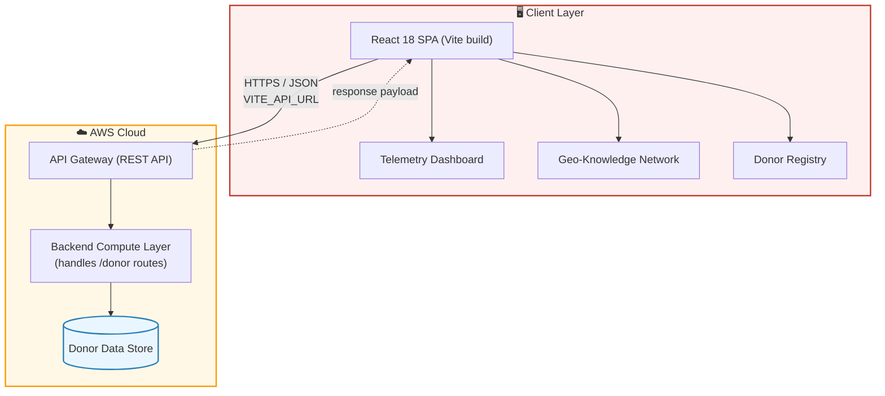
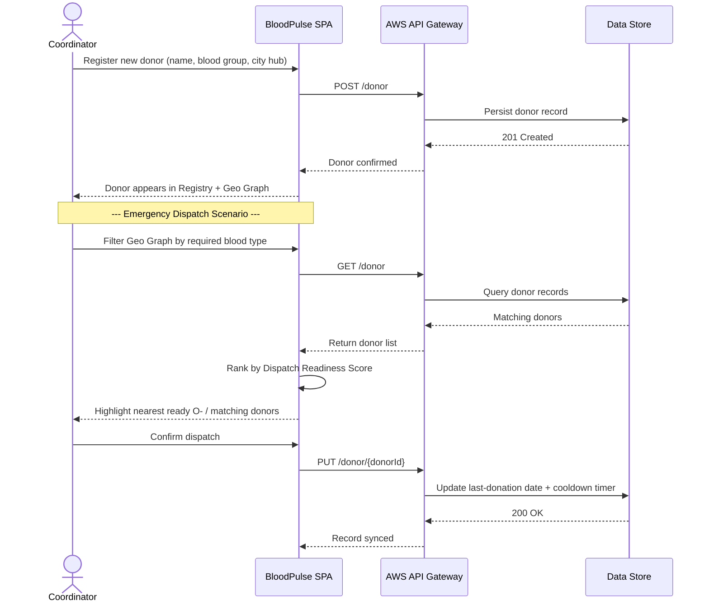
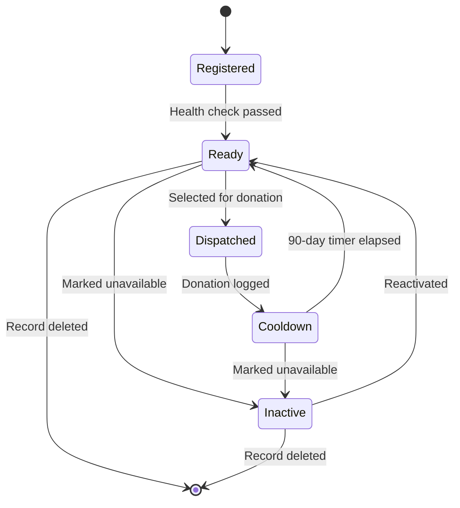

# 🩸 BloodPulse — Lifeline Donor Network & Regional Supply Control

<div align="center">


<p align="center">
  <b>Every second counts when a blood bank runs dry.</b>
  <br />
  BloodPulse turns scattered donor spreadsheets into a live, searchable, dispatch-ready network — so the right blood type reaches the right hospital before it's too late.
</p>

---

</div>

## 📌 Executive Summary

**BloodPulse** (HaemoGrid) is a clinical healthcare management web application engineered for regional blood banks, hospitals, and emergency dispatch centers. Built with **React**, **Vite**, and connected to a live **AWS API Gateway** serverless backend, BloodPulse delivers high-contrast visual telemetry, live blood group compatibility intelligence, and interactive geographic network inspection — giving coordinators a single pane of glass over an entire region's blood supply.

link: http://amzn-s3-grishma.s3-website-us-east-1.amazonaws.com/

---

## ✨ Key Features

### 📊 1. Executive Telemetry Dashboard
- **Live Inventory Metrics** — real-time counters for Total Donors, Ready Donors, Universal (O-) Donors, and Regional City Hub coverage.
- **Blood Inventory Breakdown** — visual progress distribution bars across all 8 blood groups (`A+`, `A-`, `B+`, `B-`, `AB+`, `AB-`, `O+`, `O-`).
- **Compatibility Intelligence Engine** — an interactive matrix highlighting recipient/donor compatibility rules for critical dispatch decisions.
- **Emergency Priority Alerts** — automated detection flags critical shortages in Universal Donors (O-).

### 🗺️ 2. Regional Geo-Knowledge Network (`Geo Graph`)
- **Interactive Knowledge Topology** — a visual SVG hub-and-spoke node canvas showing logistics connections between the Central Supply Base and regional city hubs (`Lalitpur`, `Chennai`, etc.).
- **Node Telemetry Inspector** — clickable regional node cards with **Dispatch Readiness Scores (0–100%)**, universal donor availability tags, and blood type inventories.
- **Instant Type Filtering** — filter network nodes by specific blood groups with a single click.

### 📋 3. Donor Management Registry
- **Instant Search & Filter** — search donors by Name, Donor ID, Phone Number, or City Hub.
- **Full CRUD Operations**:
  - **Register Donor** — add new donor records with blood group, city hub, phone number, last donation date, and health notes.
  - **View Profile** — inspect complete clinical node profiles and donation eligibility timers (90-day cooldown rules).
  - **Edit & Update** — modify existing donor data with instant API sync.
  - **Delete Record** — safely remove inactive records with confirmation modal verification.

---

## 🏗️ System Architecture

BloodPulse is a single-page React application that talks directly to a serverless AWS backend — no dedicated server to babysit, and it scales automatically with dispatch traffic.



> The Compute Layer and Data Store represent the AWS services fronted by API Gateway (e.g. a Lambda-style function and a managed database). Swap in your actual services here once finalized.

---

## 🔄 Core Workflow — From Registration to Dispatch

This is the lifecycle a donor record travels through, from sign-up to being surfaced as a match during an emergency.



---

## 🩹 Donor Eligibility State Machine

Every donor node cycles through an eligibility state governed by the 90-day cooldown rule:



---

## 🛠️ Technology Stack

| Layer | Technology |
| :--- | :--- |
| **Frontend Framework** | React 18 (Vite SPA) |
| **Typography** | Plus Jakarta Sans (Google Fonts) |
| **Styling & Theme** | Custom Vanilla CSS (Design Tokens, Medical Crimson Theme) |
| **Cloud Architecture** | AWS API Gateway (REST API) |
| **Icons & Assets** | Custom SVG Glyphs & Vector Graphics |
| **Build System** | Vite 8 + ESBuild |

---

## ⚡ API Specification

BloodPulse communicates directly with the AWS API Gateway backend endpoints:

| Method | Route | Description |
| :--- | :--- | :--- |
| `GET` | `/donor` | Fetch all registered donor records from AWS database |
| `POST` | `/donor` | Register a new donor record |
| `GET` | `/donor/{donorId}` | Fetch granular details for a specific donor ID |
| `PUT` | `/donor/{donorId}` | Update an existing donor record |
| `DELETE` | `/donor/{donorId}` | Delete a donor record from the system |

---

## 🚀 Getting Started

### 1. Prerequisites
Ensure you have **Node.js** (v18 or higher) and **npm** installed on your system.

### 2. Installation
Clone the repository and install dependencies:
```bash
git clone https://github.com/oyyPoodles/Blood---Donar---Dashboard.git
cd Blood---Donar---Dashboard
npm install
```

### 3. Environment Configuration
Create a `.env` file in the root directory:
```env
VITE_API_URL=https://e7q5zdmvb3.execute-api.us-east-1.amazonaws.com/dev
```
> ⚠️ **Note**: Do not commit `.env` to public version control. It is listed in `.gitignore`.

### 4. Run Locally
Start the Vite local development server:
```bash
npm run dev
```
Open [http://localhost:5173](http://localhost:5173) in your browser.

---

## 📦 Production Deployment

To build the production bundle for deployment (e.g. AWS S3 / CloudFront):

```bash
npm run build
```

This compiles optimized assets into the `dist/` directory:
```
dist/
├── assets/
│   ├── index-*.css
│   └── index-*.js
└── index.html
```

Upload the contents of `dist/` to your AWS S3 bucket configured for static web hosting.

---

<div align="center">

<b>BloodPulse — Empowering Lifesaving Logistics</b>
<br />
Developed for regional healthcare & blood donor networks.

</div>
